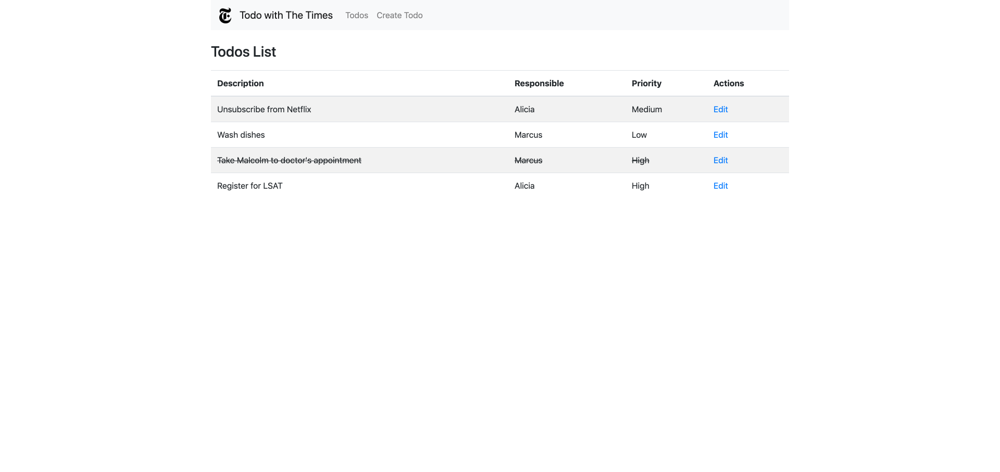
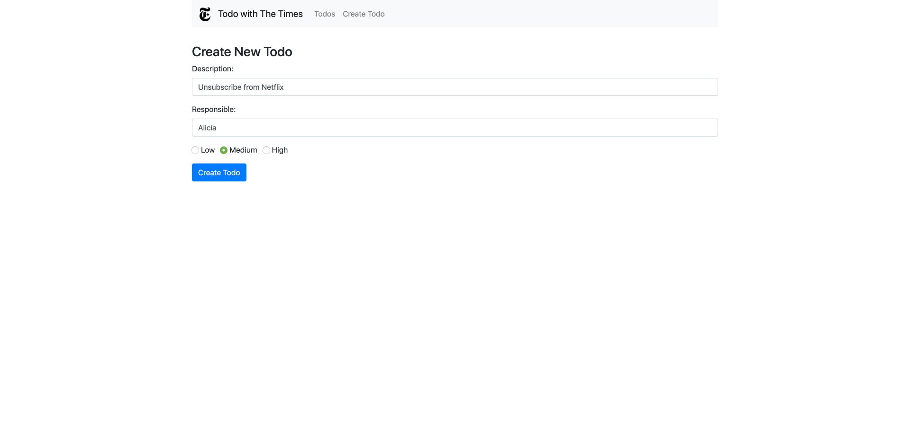
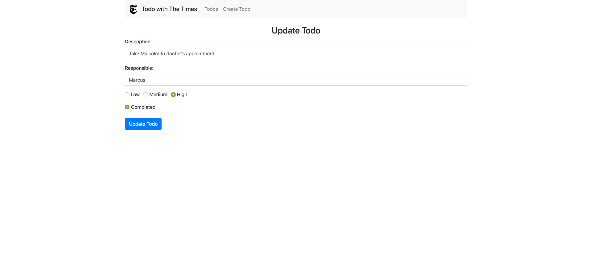

# Todo with The Times
Simple CRUD (create, read, update, and delete) web application using the MERN (MongoDB, Express, Node.js, React) stack

### Todos List

### Create Todo

### Update Todo

## Instructions for running locally
1. Open a terminal window and `cd` to project directory
2. Run `mongod` to start database server
3. Repeat step 1, run `mongo` to connect to the database server, and then `use todos` to create a new MongoDB database instance for storing todos
4. Repeat step 1, then run `nodemon server` to monitor for any changes in the source code and automatically restart the server
5. Repeat step 1, then run `npm start` to show web app in browser

**Notes**
- This project was created during Maker Week 2019 at The New York Times.
- Some of the code was adapted from a CodingTheSmartWay.com [tutorial](https://codingthesmartway.com/the-mern-stack-tutorial-building-a-react-crud-application-from-start-to-finish-part-1/).
